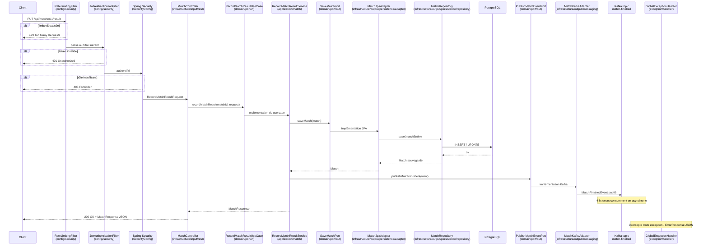

# java-tournament-manager


[](https://bertrandgoulois.github.io/java-tournament-manager/)


API REST de gestion de tournois sportifs (élimination directe, round-robin, ou phase de groupes + bracket), développée en Java 21 / Spring Boot.

---

## Technical Stack

- **Java 21** (Virtual Threads activés via `spring.threads.virtual.enabled=true`)
- **Spring Boot 4**
- **Spring Security** + **JWT** (authentification stateless)
- **Spring Data JPA** / **Hibernate**
- **PostgreSQL** (production)
- **Liquibase** (migrations versionnées)
- **Apache Kafka** (messaging distribué, remplacement des Spring Events)
- **Redis** (cache des statistiques joueur)
- **WebSocket** / **STOMP** (notifications temps réel)
- **OpenAI GPT-4o-mini** (génération de commentaires de matchs via LLM)
- **Prometheus** + **Grafana** (monitoring et visualisation des métriques JVM / HTTP)
- **OpenTelemetry** + **Jaeger** (tracing distribué, propagation du traceId à travers Kafka)
- **JSON-RPC 2.0** (API alternative coexistant avec REST, endpoint unique `POST /api/rpc`)
- **JUnit 5** + **Mockito** (tests unitaires)
- **Testcontainers** (tests d'intégration)
- **Gatling** (tests de charge)
- **Springdoc / Swagger UI** (documentation API interactive)
- **Lombok**
- **Resilience4j** (circuit breaker sur l'appel OpenAI)
- **Bucket4j** + **Redis** (rate limiting distribué, buckets partagés entre instances via Lettuce)

---

## Architecture & Design

Le projet suit une **architecture hexagonale** (ports & adapters) : le domaine métier est isolé de toute dépendance technique (JPA, Kafka, Redis, OpenAI). Le flux de dépendances va toujours de l'extérieur vers le domaine, jamais l'inverse.

```
src/main/java/com/tournament/tournament_manager/
├── domain/
│   ├── model/              -> entités, enums, value objects
│   ├── event/              -> événements du domaine (MatchFinishedEvent)
│   └── port/
│       ├── in/             -> interfaces use cases (ex. CreateTournamentUseCase)
│       ├── out/            -> interfaces adapters sortants (ex. SaveMatchPort)
│       └── out/strategy/   -> interfaces stratégies (TournamentStartStrategy, TournamentProgressionStrategy)
│
├── application/
│   ├── tournament/         -> implémentations use cases tournoi (CreateTournamentService, ...)
│   ├── bracket/            -> implémentations use cases bracket (AdvanceBracketService, ...)
│   ├── match/              -> implémentations use cases match
│   ├── player/             -> implémentations use cases joueur
│   ├── registration/       -> implémentations use cases inscription
│   ├── elo/                -> implémentations use cases ELO
│   ├── auth/               -> implémentations use cases authentification
│   ├── token/              -> implémentations use cases refresh token
│   ├── rpc/                -> dispatcher JSON-RPC (JsonRpcDispatchService)
│   ├── shared/             -> utilitaires partagés (BracketUtils, RoundRobinUtils)
│   └── strategy/
│       ├── start/          -> stratégies de démarrage (SingleEliminationStartStrategy, ...)
│       └── progression/    -> stratégies de progression (SingleEliminationProgressionStrategy, ...)
│
├── infrastructure/
│   ├── input/
│   │   ├── rest/           -> controllers REST (TournamentController, MatchController, ...)
│   │   ├── messaging/      -> consumers Kafka (BracketListener, EloListener, ...)
│   │   ├── rpc/            -> handlers JSON-RPC par domaine (tournament/, player/, match/, registration/)
│   │   └── scheduler/      -> jobs planifiés (PurgeService)
│   └── output/
│       ├── persistence/
│       │   ├── adapter/    -> adapters JPA (PlayerJpaAdapter, MatchJpaAdapter, ...)
│       │   └── repository/ -> repositories Spring Data (PlayerRepository, MatchRepository, ...)
│       ├── messaging/      -> producer Kafka (MatchKafkaAdapter)
│       └── client/         -> clients HTTP externes (OpenAiCommentaryAdapter)
│
├── config/                 -> configuration Spring (Redis, Jackson, Swagger, Cache, Security, Kafka, WebSocket)
└── exception/
    ├── domain/             -> exceptions métier (NotFoundException, InvalidException, ...)
    └── handler/            -> GlobalExceptionHandler, ErrorResponse
```

### Flux d'un appel REST

Exemple : `PUT /api/matches/1/result` - du client jusqu'à la réponse HTTP.



### Architecture hexagonale

- `domain/` ne dépend d'aucune librairie technique
- `application/` implémente les use cases en s'appuyant sur les ports du domaine
- `infrastructure/input/` contient les **adapters primaires** : ce qui déclenche le domaine (REST, Kafka consumers, scheduler)
- `infrastructure/output/` contient les **adapters secondaires** : ce dont le domaine a besoin (base de données, Kafka producer, OpenAI)
- `config/` configure le contexte Spring sans appartenir au domaine ni à l'infra

### Multi-format de tournoi via pattern Strategy

Un tournoi peut être créé selon trois formats (`TournamentFormat`) :

- `SINGLE_ELIMINATION` (par défaut) - bracket en élimination directe
- `ROUND_ROBIN` - chaque joueur affronte tous les autres une fois, classement par points
- `GROUPS_THEN_KNOCKOUT` - phase de groupes round-robin puis bracket en élimination directe entre les qualifiés

Le pattern **Strategy** est appliqué à deux niveaux :

**Démarrage** (`StartTournamentService`) - Spring injecte toutes les implémentations de `TournamentStartStrategy`, indexées par format :

- `SingleEliminationStartStrategy` -> mélange aléatoire et génère le premier tour du bracket (avec byes si effectif impair)
- `RoundRobinStartStrategy` -> génère l'intégralité des confrontations via la **méthode du cercle** (`RoundRobinUtils`)
- `GroupsThenKnockoutStartStrategy` -> répartit les joueurs en `numberOfGroups` groupes égaux, puis génère un round-robin par groupe

**Progression** (`BracketListener`) - Spring injecte toutes les implémentations de `TournamentProgressionStrategy`, indexées par format :

- `SingleEliminationProgressionStrategy` -> avancement round par round via `AdvanceBracketService`
- `RoundRobinProgressionStrategy` -> vérification d'achèvement global via `CheckTournamentCompletionService`
- `GroupsThenKnockoutProgressionStrategy` -> route selon la nature du match (groupe ou bracket)

Pour ajouter un nouveau format, il suffit de créer deux nouvelles classes `@Component` - aucune modification des services existants n'est nécessaire.

### API JSON-RPC 2.0

En parallèle de l'API REST, un endpoint unique `POST /api/rpc` expose les mêmes opérations métier. Le dispatcher (`JsonRpcDispatchService`) réutilise le même pattern Strategy : Spring injecte automatiquement tous les handlers (`@Component` implémentant `JsonRpcMethodHandler`), indexés par nom de méthode. Aucune logique métier n'est dupliquée.

Méthodes disponibles : `tournament.create`, `tournament.start`, `tournament.getById`, `tournament.getAll`, `tournament.delete`, `tournament.getBracket`, `tournament.getStandings`, `player.create`, `player.getById`, `player.getAll`, `player.getStats`, `player.delete`, `registration.register`, `registration.getByTournament`, `match.getById`, `match.recordResult`, `match.getCommentary`.

### Architecture événementielle (Kafka)

Les side effects métier sont découplés du service principal via Kafka. Lorsqu'un résultat de match est enregistré, un événement `MatchFinishedEvent` est publié sur le topic `match-finished`. Quatre consumers indépendants traitent cet événement de façon asynchrone :

- `elo-group` -> mise à jour des ratings ELO
- `bracket-group` -> progression du tournoi via `TournamentProgressionStrategy`
- `websocket-group` -> notification temps réel via WebSocket
- `commentary-group` -> génération de commentaire via OpenAI GPT-4o-mini

En cas d'échec répété (3 tentatives espacées d'1 seconde), le message est redirigé vers `match-finished.DLT` pour inspection et rejeu via Kafka UI.

> L'appel OpenAI est protégé par un circuit breaker Resilience4j. En cas d'échec, le fallback logue l'incident sans bloquer les autres listeners.

**Test WebSocket** : page de démonstration disponible sur `http://localhost:8080/ws-test.html`.

### Purge des soft deletes

Les joueurs et tournois supprimés (soft delete) sont conservés en base pendant 30 jours (configurable via `purge.retention-days`), puis supprimés physiquement par un job `@Scheduled` qui tourne tous les jours à 2h du matin (`PurgeService`).

---

## Installation & Configuration

1. Cloner le projet :

```bash
git clone https://github.com/BertrandGoulois/java-tournament-manager.git
cd java-tournament-manager
```

2. Créer un fichier `.env` à la racine :

```
POSTGRES_PASSWORD=tonmotdepasse
OPENAI_API_KEY=sk-...ta-clef
```

3. Créer `src/main/resources/application-local.properties` :

```properties
spring.datasource.url=jdbc:postgresql://localhost:5432/tournament_manager
spring.datasource.username=postgres
spring.datasource.password=tonmotdepasse
openai.api.key=sk-...ta-clef
```

4. Démarrer tous les services :

```bash
docker-compose up -d
```

---

## Running

**Démarrage en local :**

```bash
./mvnw spring-boot:run
```

**Tests unitaires :**

```bash
./mvnw test
```

**Tests d'intégration (nécessitent Docker) :**

```bash
./mvnw verify
```

> `KafkaIntegrationTest`, `PlayerIntegrationTest`, `RoundRobinIntegrationTest`, `GroupsThenKnockoutIntegrationTest`, `PurgeServiceIntegrationTest` et `OpenAiCommentaryAdapterCircuitBreakerTest` sont exclus de la CI standard.

**Tests de charge (Gatling) :**

```bash
./mvnw gatling:test
```

**URLs utiles :**

| Service | URL |
|---|---|
| API | `http://localhost:8080` |
| Swagger UI | `http://localhost:8080/swagger-ui/index.html` |
| WebSocket test | `http://localhost:8080/ws-test.html` |
| Kafka UI | `http://localhost:8090` |
| Prometheus | `http://localhost:9090` |
| Grafana | `http://localhost:3000` (admin / admin) |
| Jaeger UI | `http://localhost:16686` |

---

## Endpoints

### Authentication

#### Login

- **POST** `/api/auth/login`
- **Body JSON** :

```json
{
  "username": "admin",
  "password": "password123"
}
```

- **Response JSON** :

```json
{
  "token": "<JWT access token>",
  "refreshToken": "<refresh token>"
}
```

#### Refresh token

- **POST** `/api/auth/refresh`
- **Body JSON** :

```json
{ "refreshToken": "<refresh token>" }
```

#### Logout

- **POST** `/api/auth/logout`
- **Body JSON** :

```json
{ "refreshToken": "<refresh token>" }
```

---

### Players

#### Create player

- **POST** `/api/players`
- **Body JSON** :

```json
{
  "username": "player1",
  "email": "player1@mail.com"
}
```

#### Get all players

- **GET** `/api/players?page=0&size=10&sort=username,asc`

#### Get player by ID

- **GET** `/api/players/{id}`

#### Delete player (soft delete)

- **DELETE** `/api/players/{id}`

#### Get player stats

- **GET** `/api/players/{id}/stats`

---

### Tournaments

#### Create tournament

- **POST** `/api/tournaments`
- **Body JSON** (`SINGLE_ELIMINATION` ou `ROUND_ROBIN`) :

```json
{
  "name": "Spring Championship",
  "maxPlayers": 8,
  "format": "SINGLE_ELIMINATION"
}
```

- **Body JSON** (`GROUPS_THEN_KNOCKOUT`) :

```json
{
  "name": "Spring Groups Cup",
  "maxPlayers": 8,
  "format": "GROUPS_THEN_KNOCKOUT",
  "numberOfGroups": 2,
  "qualifiersPerGroup": 2
}
```

> `format` optionnel - `SINGLE_ELIMINATION` par défaut. `numberOfGroups` et `qualifiersPerGroup` requis uniquement pour `GROUPS_THEN_KNOCKOUT`.

- **Errors** :
  - `400` -> `maxPlayers` n'est pas une puissance de 2 (SINGLE_ELIMINATION uniquement)
  - `400` -> configuration de groupes invalide (GROUPS_THEN_KNOCKOUT)
  - `409` -> nom déjà utilisé

#### Get all tournaments

- **GET** `/api/tournaments?page=0&size=10`

#### Get tournament by ID

- **GET** `/api/tournaments/{id}`

#### Delete tournament (soft delete)

- **DELETE** `/api/tournaments/{id}`

#### Start tournament

- **POST** `/api/tournaments/{id}/start`

#### Get tournament bracket

- **GET** `/api/tournaments/{id}/bracket`

#### Get tournament standings

- **GET** `/api/tournaments/{id}/standings`

> Pertinent pour `ROUND_ROBIN`. 3 points par victoire, trié par points décroissants.

---

### Registrations

#### Register player

- **POST** `/api/registrations`
- **Body JSON** :

```json
{
  "playerId": 1,
  "tournamentId": 1
}
```

#### Get tournament registrations

- **GET** `/api/registrations/{tournamentId}`

---

### Matches

#### Get match by ID

- **GET** `/api/matches/{id}`

#### Record match result

- **PUT** `/api/matches/{id}/result`
- **Body JSON** :

```json
{ "winnerId": 1 }
```

#### Get match commentary

- **GET** `/api/matches/{id}/commentary`

---

### JSON-RPC

- **POST** `/api/rpc`
- **Body JSON** :

```json
{
  "jsonrpc": "2.0",
  "method": "tournament.create",
  "params": { "name": "Spring Championship", "maxPlayers": 8, "format": "SINGLE_ELIMINATION" },
  "id": "1"
}
```

- **Response (succès)** :

```json
{ "jsonrpc": "2.0", "result": { }, "error": null, "id": "1" }
```

- **Response (erreur)** :

```json
{
  "jsonrpc": "2.0",
  "result": null,
  "error": { "code": -32601, "message": "Method not found: unknown.method", "data": null },
  "id": "1"
}
```

> Statut HTTP toujours `200` même en cas d'erreur applicative (spec JSON-RPC 2.0). Codes : `-32601` methode inconnue, `-32602` parametres invalides, `-32603` erreur interne.

### Reponses d'erreur

Toutes les erreurs REST retournent un JSON uniforme :

```json
{
  "status": 404,
  "error": "Not Found",
  "message": "Player not found with id: 42",
  "timestamp": "2026-07-07T14:32:00"
}
```

---

## Key Features

- Architecture hexagonale (ports & adapters) - `domain/`, `application/`, `infrastructure/input/`, `infrastructure/output/`
- Use cases atomiques : une classe par use case
- Pattern Strategy a deux niveaux : demarrage (`TournamentStartStrategy`) et progression (`TournamentProgressionStrategy`) - extensible sans modifier le code existant
- Support multi-format (`SINGLE_ELIMINATION`, `ROUND_ROBIN`, `GROUPS_THEN_KNOCKOUT`)
- Generation round-robin via methode du cercle (chaque paire se rencontre exactement une fois)
- Phase de groupes configurable avec transition automatique vers bracket final
- Classement round-robin calcule a la demande (`GET /tournaments/{id}/standings`)
- API JSON-RPC 2.0 en parallele de REST - meme pattern Strategy pour le dispatch
- Reponses d'erreur uniformes via `GlobalExceptionHandler` + `ErrorResponse`
- Documentation API interactive via Swagger UI (`@Operation`, `@ApiResponse`, `@Tag`) avec schéma d'erreur uniforme
- Calcul ELO après chaque match (K=32, formule standard), idempotent
- Progression de tournoi multi-format event-driven via Kafka
- Generation automatique de commentaires via OpenAI GPT-4o-mini
- Dead Letter Queue Kafka (`match-finished.DLT`) + Kafka UI pour rejeu manuel
- Notifications temps reel via WebSocket
- Cache Redis sur les statistiques joueur
- Authentification JWT avec refresh token et revocation
- Rate limiting distribué (Bucket4j + Redis, fenêtre glissante `refillGreedy`) - partagé entre instances
- Restrictions par role ADMIN/PLAYER sur les endpoints (401 non authentifie, 403 non autorise)
- Purge périodique des soft deletes (`@Scheduled`, rétention configurable)
- Tracing distribué OpenTelemetry + Jaeger - propagation du traceId à travers Kafka
- Monitoring Prometheus / Grafana
- Tests de charge Gatling - scénario end-to-end 500 utilisateurs simultanés
- Couverture élevée : unitaires (JUnit 5 / Mockito), controller (MockMvc), intégration (Testcontainers)
- Circuit breaker Resilience4j sur OpenAI (CLOSED -> OPEN -> HALF_OPEN teste)

---

## Evolutions possibles

- Métriques business custom dans Grafana (nb tournois créés, matchs joués...)
- Pagination cursor-based pour les grandes tables
- Reverse proxy nginx pour validation complete de `X-Forwarded-For` en production
