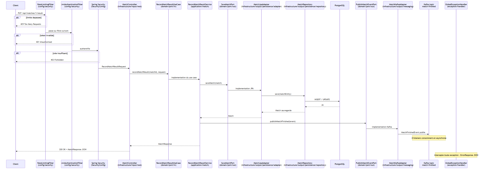

# java-tournament-manager


[](https://bertrandgoulois.github.io/java-tournament-manager/)


API REST de gestion de tournois sportifs (élimination directe, round-robin, ou phase de groupes + bracket), développée en Java 21 / Spring Boot.

---

## Technical Stack

- **Java 21** (Virtual Threads activés via `spring.threads.virtual.enabled=true`)
- **Spring Boot 4**
- **Spring Security** + **JWT** (authentification stateless)
- **Spring Data JPA** / **Hibernate**
- **Jackson 3** (`tools.jackson`, migration complète depuis Jackson 2 - voir `JacksonConfig`, `CacheConfig`)
- **PostgreSQL** (production)
- **Liquibase** (migrations versionnées)
- **Apache Kafka** (messaging distribué, remplacement des Spring Events)
- **Redis** (cache des statistiques joueur)
- **WebSocket** / **STOMP** (notifications temps réel)
- **OpenAI GPT-4o-mini** (génération de commentaires de matchs via LLM)
- **Prometheus** + **Grafana** (monitoring et visualisation des métriques JVM / HTTP)
- **OpenTelemetry** + **Jaeger** (tracing distribué, propagation du traceId à travers Kafka)
- **JSON-RPC 2.0** (API alternative coexistant avec REST, endpoint unique `POST /api/rpc`)
- **JUnit 5** + **Mockito** (tests unitaires)
- **Testcontainers** (tests d'intégration)
- **Gatling** (tests de charge)
- **Springdoc / Swagger UI** (documentation API interactive)
- **Lombok**
- **Resilience4j** (circuit breaker sur l'appel OpenAI)
- **Bucket4j** + **Redis** (rate limiting distribué, buckets partagés entre instances via Lettuce - couvre `POST /api/players` et son équivalent JSON-RPC `player.create` avec le même bucket ; mode dégradé fail-open si Redis est indisponible)
- **Nginx** (reverse proxy, point d'entrée unique sur le port 80, `X-Forwarded-For` fiable)

---

## Architecture & Design

Le projet suit une **architecture hexagonale** (ports & adapters) : le domaine métier (`domain/`) est isolé de toute dépendance technique (JPA/Hibernate, Spring - y compris `Page`/`Pageable` -, Lombok, Kafka, Jackson, mais aussi les DTO REST/JSON-RPC). Les objets de domaine (`domain/model/`, ex. `Player`, `Match`, `Tournament`) sont de purs POJO, sans aucune annotation ; leur persistance est gérée séparément par des entités JPA dédiées (`infrastructure/output/persistence/entity/`) et des mappers explicites (`infrastructure/output/persistence/mapper/`) qui font la conversion aux deux frontières. Le flux de dépendances va toujours de l'extérieur vers le domaine, jamais l'inverse.

Les **13 ports entrants** (`domain/port/in/`, ex. `GetPlayerUseCase`, `CreateTournamentUseCase`) s'expriment eux aussi entièrement dans le vocabulaire du domaine : ils prennent en entrée des objets de domaine purs ou de simples commandes (`CreatePlayerCommand`, `RecordMatchResultCommand`...), et retournent des objets de domaine purs (`Player`, `Tournament`, `Bracket`, `Standings`...) - jamais un DTO annoté Swagger (`@Schema`) ou Jakarta Validation (`@NotBlank`). Chaque adaptateur d'entrée convertit à sa propre frontière, via un mapper dédié :

- **REST** (`infrastructure/input/rest/`) : `infrastructure/input/mapper/` (`PlayerRestMapper`, `TournamentRestMapper`...) convertit entre DTO REST (`dto.request`/`dto.response`, avec Swagger et validation) et domaine pur
- **JSON-RPC** (`infrastructure/input/rpc/`) : chaque handler réutilise ces mêmes mappers REST pour construire ses commandes et ses réponses - un choix délibéré de réutilisation à la frontière (les deux canaux exposent la même donnée), pas une contrainte architecturale : avant cette séparation, JSON-RPC n'avait pas d'autre choix que de réutiliser les DTO REST puisque les ports eux-mêmes les imposaient déjà

> Ces deux règles (aucune dépendance technique, aucun DTO REST/JSON-RPC) sont vérifiées en continu par un test ArchUnit (`DomainIsolationTest`), qui échoue si quiconque en réintroduit une dans `domain/` - une règle non vérifiée par la CI n'existe pas.

```
src/main/java/com/tournament/tournament_manager/
├── domain/
│   ├── model/              -> entités, enums, value objects
│   ├── event/              -> événements du domaine (MatchFinishedEvent)
│   └── port/
│       ├── in/             -> interfaces use cases (ex. CreateTournamentUseCase)
│       ├── out/            -> interfaces adapters sortants (ex. SaveMatchPort)
│       └── out/strategy/   -> interfaces stratégies (TournamentStartStrategy, TournamentProgressionStrategy)
│
├── application/
│   ├── tournament/         -> implémentations use cases tournoi (CreateTournamentService, ...)
│   ├── bracket/            -> implémentations use cases bracket (AdvanceBracketService, ...)
│   ├── match/              -> implémentations use cases match
│   ├── player/             -> implémentations use cases joueur
│   ├── registration/       -> implémentations use cases inscription
│   ├── elo/                -> implémentations use cases ELO
│   ├── auth/               -> implémentations use cases authentification
│   ├── token/              -> implémentations use cases refresh token
│   ├── rpc/                -> dispatcher JSON-RPC (JsonRpcDispatchService)
│   ├── shared/             -> utilitaires partagés (BracketUtils, RoundRobinUtils)
│   └── strategy/
│       ├── start/          -> stratégies de démarrage (SingleEliminationStartStrategy, ...)
│       └── progression/    -> stratégies de progression (SingleEliminationProgressionStrategy, ...)
│
├── infrastructure/
│   ├── input/
│   │   ├── rest/           -> controllers REST (TournamentController, MatchController, ...)
│   │   ├── mapper/         -> conversion DTO REST <-> domaine pur (PlayerRestMapper, TournamentRestMapper, ...), réutilisés par rpc/
│   │   ├── messaging/      -> consumers Kafka (BracketListener, EloListener, ...)
│   │   ├── rpc/            -> handlers JSON-RPC par domaine (tournament/, player/, match/, registration/)
│   │   └── scheduler/      -> jobs planifiés (PurgeService, OutboxPublisherService)
│   └── output/
│       ├── persistence/
│       │   ├── adapter/    -> adapters JPA (PlayerJpaAdapter, MatchJpaAdapter, ...)
│       │   └── repository/ -> repositories Spring Data (PlayerRepository, MatchRepository, ...)
│       ├── messaging/      -> écriture outbox pour Kafka (MatchKafkaAdapter, voir OutboxPublisherService)
│       └── client/         -> clients HTTP externes (OpenAiCommentaryAdapter)
│
├── config/                 -> configuration Spring (Redis, Jackson, Swagger, Cache, Security, Kafka, WebSocket)
└── exception/
    ├── domain/             -> exceptions métier (NotFoundException, InvalidException, ...)
    └── handler/            -> GlobalExceptionHandler, ErrorResponse
```

### Flux d'un appel REST

Exemple : `PUT /api/matches/1/result` - du client jusqu'à la réponse HTTP.



1. **RateLimitingFilter** (`config/security/`) - vérifie le bucket Redis par IP (partagé avec `POST /api/rpc` en cas d'opération équivalente) → `429` si dépassé ; mode dégradé (laisse passer) si Redis est indisponible
2. **JwtAuthenticationFilter** (`config/security/`) - valide le JWT → `401` si invalide
3. **Spring Security** (`SecurityConfig`) - vérifie le rôle ADMIN → `403` si insuffisant
4. **MatchController** (`infrastructure/input/rest/`) - adapter primaire, désérialise la requête en `RecordMatchResultRequest`, puis convertit en `RecordMatchResultCommand` via `MatchRestMapper` (voir point 22 : le port ci-dessous ne connaît jamais ce DTO)
5. **RecordMatchResultUseCase** (`domain/port/in/`) - interface du port entrant, définit le contrat dans le vocabulaire du domaine (`RecordMatchResultCommand` en entrée, `Match` en sortie)
6. **RecordMatchResultService** (`application/match/`) - implémente le port entrant, logique métier pure, ne manipule que des objets de domaine
7. **SaveMatchPort** (`domain/port/out/`) - interface du port sortant "sauvegarder un match"
8. **MatchJpaAdapter** (`infrastructure/output/persistence/adapter/`) - implémente `SaveMatchPort`, traduit vers JPA
9. **MatchRepository** (`infrastructure/output/persistence/repository/`) - Spring Data JPA
10. **PostgreSQL** - persistance physique du match
11. **PublishMatchEventPort** (`domain/port/out/`) - interface du port sortant "publier un événement"
12. **MatchKafkaAdapter** (`infrastructure/output/messaging/`) - implémente `PublishMatchEventPort` **via le pattern Outbox** : écrit une ligne dans `outbox_events`, dans la **même transaction** que le match (pas d'appel Kafka direct ici)
13. **OutboxPublisherService** (`infrastructure/input/scheduler/`) - poller indépendant (toutes les 500ms, hors de toute transaction métier) qui publie réellement les événements en attente vers Kafka, avec la clé de partition `tournamentId`
14. **Kafka** `match-finished` - les 4 listeners consomment en asynchrone (ELO, Bracket, WebSocket, Commentary)
15. **GlobalExceptionHandler** (`exception/handler/`) - intercepte toute exception → `ErrorResponse` JSON uniforme
16. **MatchController** - reconvertit le `Match` du domaine en `MatchResponse` via `MatchRestMapper`, retourne `200 OK` + JSON au client

> Pourquoi l'écriture Kafka n'a pas lieu directement à l'étape 12 : si elle avait lieu pendant la transaction (avant le commit), un rollback après envoi laisserait les consumers traiter un match jamais réellement passé à `FINISHED`, et un consumer rapide pourrait lire le match avant le commit. Le pattern Outbox rend l'écriture DB et la publication Kafka atomiques l'une vis-à-vis de l'autre : soit les deux finissent par arriver, soit ni l'une ni l'autre.

### Architecture hexagonale

- `domain/` ne dépend d'aucune librairie technique ni d'aucun DTO REST/JSON-RPC (voir `DomainIsolationTest`)
- `application/` implémente les use cases en s'appuyant sur les ports du domaine
- `infrastructure/input/` contient les **adapters primaires** : ce qui déclenche le domaine (REST, Kafka consumers, scheduler)
- `infrastructure/output/` contient les **adapters secondaires** : ce dont le domaine a besoin (base de données, Kafka producer, OpenAI)
- `config/` configure le contexte Spring sans appartenir au domaine ni à l'infra

### Multi-format de tournoi via pattern Strategy

Un tournoi peut être créé selon trois formats (`TournamentFormat`) :

- `SINGLE_ELIMINATION` (par défaut) - bracket en élimination directe
- `ROUND_ROBIN` - chaque joueur affronte tous les autres une fois, classement par points
- `GROUPS_THEN_KNOCKOUT` - phase de groupes round-robin puis bracket en élimination directe entre les qualifiés

Le pattern **Strategy** est appliqué à deux niveaux :

**Démarrage** (`StartTournamentService`) - Spring injecte toutes les implémentations de `TournamentStartStrategy`, indexées par format :

- `SingleEliminationStartStrategy` -> **seede les joueurs par classement ELO** (`BracketUtils.seedByElo` + `seedOrder`, algorithme de seeding standard des tournois à élimination directe) et génère le premier tour ; les byes nécessaires (si l'effectif n'est pas une puissance de 2) vont aux meilleurs seeds en priorité. Le seed 1 et le seed 2 ne peuvent se rencontrer qu'en finale, jamais avant.
- `RoundRobinStartStrategy` -> génère l'intégralité des confrontations via la **méthode du cercle** (`RoundRobinUtils`)
- `GroupsThenKnockoutStartStrategy` -> répartit les joueurs en `numberOfGroups` groupes égaux, puis génère un round-robin par groupe

**Progression** (`BracketListener`) - Spring injecte toutes les implémentations de `TournamentProgressionStrategy`, indexées par format :

- `SingleEliminationProgressionStrategy` -> avancement round par round via `AdvanceBracketService`, déterministe (le vainqueur des matchs aux positions `2k`/`2k+1` avance vers la position `k` du round suivant - pas de retirage), et idempotent face à la redelivery Kafka (contrainte d'unicité `UNIQUE(tournament_id, round)` sur une table dédiée `round_advancements`, réclamée en transaction indépendante avant toute création de match)
- `RoundRobinProgressionStrategy` -> vérification d'achèvement global via `CheckTournamentCompletionService`
- `GroupsThenKnockoutProgressionStrategy` -> route selon la nature du match (groupe ou bracket), même seeding ELO que `SingleEliminationStartStrategy` pour le bracket final entre qualifiés

Pour ajouter un nouveau format, il suffit de créer deux nouvelles classes `@Component` - aucune modification des services existants n'est nécessaire.

> **`round` contient la taille du bracket, pas un numéro de tour.** Historiquement nommé ainsi, sa valeur va en décroissant (16, 8, 4, 2 - jamais 1, 2, 3, 4). Nommage conservé tel quel pour l'instant (cosmétique, gros impact sur l'API publique) ; voir aussi `position`, la place déterministe d'un match au sein de son round, qui permet de reconstruire un vrai arbre de bracket côté client.

### API JSON-RPC 2.0

En parallèle de l'API REST, un endpoint unique `POST /api/rpc` expose les mêmes opérations métier. Le dispatcher (`JsonRpcDispatchService`) réutilise le même pattern Strategy : Spring injecte automatiquement tous les handlers (`@Component` implémentant `JsonRpcMethodHandler`), indexés par nom de méthode. Aucune logique métier n'est dupliquée.

Méthodes disponibles : `tournament.create`, `tournament.start`, `tournament.getById`, `tournament.getAll`, `tournament.delete`, `tournament.getBracket`, `tournament.getStandings`, `player.create`, `player.getById`, `player.getAll`, `player.getStats`, `player.delete`, `registration.register`, `registration.getByTournament`, `match.getById`, `match.recordResult`, `match.getCommentary`.

### Architecture événementielle (Kafka)

Les side effects métier sont découplés du service principal via Kafka. Lorsqu'un résultat de match est enregistré, un événement `MatchFinishedEvent` est publié sur le topic `match-finished`. Quatre consumers indépendants traitent cet événement de façon asynchrone :

- `elo-group` -> mise à jour des ratings ELO
- `bracket-group` -> progression du tournoi via `TournamentProgressionStrategy`
- `websocket-group` -> notification temps réel via WebSocket (connexion authentifiée par JWT, voir plus bas)
- `commentary-group` -> génération de commentaire via OpenAI GPT-4o-mini

En cas d'échec répété (3 tentatives espacées d'1 seconde), le message est redirigé vers `match-finished.DLT` pour inspection et rejeu via Kafka UI.

> L'appel OpenAI est protégé par un circuit breaker Resilience4j. En cas d'échec, le fallback logue l'incident sans bloquer les autres listeners.

**Pattern Outbox transactionnel.** La publication ne se fait jamais directement pendant la transaction métier. `RecordMatchResultService` écrit le match ET une ligne dans `outbox_events`, dans la même transaction (atomique par construction). Un poller séparé, `OutboxPublisherService`, tourne toutes les 500ms hors de toute transaction métier :

- verrouille un lot d'événements non publiés avec `FOR UPDATE SKIP LOCKED` (sûr avec plusieurs instances de l'app en parallèle)
- les envoie réellement à Kafka, avec `tournamentId` comme clé de partition (ordre garanti par tournoi une fois le topic multi-partitions)
- marque `publishedAt` en cas de succès ; en cas d'échec (Kafka indisponible), la ligne reste en base et sera retentée au cycle suivant - jamais silencieusement perdue

Les événements publiés sont purgés périodiquement par `PurgeService` (voir ci-dessous) ; les non-publiés ne le sont jamais, quel que soit leur âge.

**Test WebSocket** : page de démonstration disponible sur `http://localhost/ws-test.html` (nécessite un token JWT, récupérable via `POST /api/auth/login`, saisi dans le champ dédié avant de se connecter).

### Purge périodique

Un job `@Scheduled` (`PurgeService`) tourne tous les jours à 2h du matin et purge trois choses :

- les joueurs et tournois soft-deleted depuis plus de `purge.retention-days` jours (défaut 30, configurable)
- les refresh tokens expirés (indépendamment de `purge.retention-days` - un token expiré n'a plus aucun usage)
- les événements outbox déjà publiés depuis plus de `purge.retention-days` jours (les non-publiés ne sont jamais purgés : un événement bloqué signale un problème à corriger, pas à faire disparaître silencieusement)

---

## Installation & Configuration

1. Cloner le projet :

```bash
git clone https://github.com/BertrandGoulois/java-tournament-manager.git
cd java-tournament-manager
```

2. Créer un fichier `.env` à la racine :

```
POSTGRES_PASSWORD=tonmotdepasse
JWT_SECRET=une-valeur-base64-generee-avec-openssl-rand-base64-32
OPENAI_API_KEY=sk-...ta-clef
GRAFANA_ADMIN_PASSWORD=tonmotdepasse-grafana
REDIS_PASSWORD=tonmotdepasse-redis
```

> `JWT_SECRET` doit être une chaîne Base64 valide. Génère-en une avec `openssl rand -base64 32`.

3. Démarrer tous les services :

```bash
docker-compose up -d
```

> `src/main/resources/application-local.properties` lit déjà `POSTGRES_PASSWORD` et `OPENAI_API_KEY` depuis l'environnement (`${...}`) - aucune valeur en clair à y écrire. Si tu lances l'app en dehors de Docker (`./mvnw spring-boot:run`), exporte les mêmes variables dans ton shell avant de démarrer.

---

## Running

**Démarrage en local :**

```bash
./mvnw spring-boot:run
```

**Tests unitaires (aucune dépendance externe, pas de Docker requis) :**

```bash
./mvnw verify
```

> Génère aussi le rapport de couverture JaCoCo. Les tests nécessitant Testcontainers (Postgres/Redis/Kafka) en sont exclus - voir ci-dessous.

**Tests de mutation (PIT) :**

```bash
./mvnw pitest:mutationCoverage
```

> Rapport HTML généré dans `target/pit-reports/index.html`. Score actuel : 88% de mutation coverage sur la couche `application/`.

**Tests d'intégration (nécessitent Docker en cours d'exécution) :**

```bash
./mvnw test -Pintegration-tests
```

> Fait tourner `KafkaIntegrationTest`, `PlayerIntegrationTest`, `RoundRobinIntegrationTest`, `GroupsThenKnockoutIntegrationTest`, `PurgeServiceIntegrationTest`, `OpenAiCommentaryAdapterCircuitBreakerTest` et `RateLimitingFilterTest`, chacun dans sa propre JVM (`reuseForks=false`) avec retry automatique en cas d'échec transitoire. Tournent en CI dans un job séparé (`integration-tests`), non-bloquant, indépendant du job principal qui génère le badge de couverture.

**Tests de charge (Gatling) :**

```bash
./mvnw gatling:test
```

**URLs utiles :**

| Service | URL |
|---|---|
| API | `http://localhost` (via Nginx) |
| Swagger UI | `http://localhost/swagger-ui/index.html` |
| WebSocket test | `http://localhost/ws-test.html` |
| Kafka UI | `http://localhost:8090` |
| Prometheus | `http://localhost:9090` |
| Grafana | `http://localhost:3000` (admin / valeur de `GRAFANA_ADMIN_PASSWORD` dans `.env`) |
| Jaeger UI | `http://localhost:16686` |
| Health (détails, port de management) | `http://localhost:9001/actuator/health` |
| Liveness / readiness (port principal, public) | `http://localhost/livez`, `http://localhost/readyz` |

---

## Endpoints

### Authentication

#### Login

- **POST** `/api/auth/login`
- **Body JSON** :

```json
{
  "username": "admin",
  "password": "password123"
}
```

- **Response JSON** :

```json
{
  "token": "<JWT access token>",
  "refreshToken": "<refresh token>"
}
```

#### Refresh token

- **POST** `/api/auth/refresh`
- **Body JSON** :

```json
{ "refreshToken": "<refresh token>" }
```

- **Réponse** : un nouvel access token **et un nouveau refresh token** (rotation à chaque
  appel - remplace systématiquement le refresh token stocké côté client par celui reçu en
  retour ; l'ancien devient inutilisable immédiatement).

> **Une seule session active par utilisateur.** Se connecter (`/api/auth/login`) révoque tous
> les refresh tokens existants de l'utilisateur avant d'en émettre un nouveau. Se connecter
> sur un second appareil déconnecte donc silencieusement le premier - c'est un choix assumé
> (pas de sessions concurrentes), pas une limitation technique à contourner.

#### Logout

- **POST** `/api/auth/logout`
- **Body JSON** :

```json
{ "refreshToken": "<refresh token>" }
```

---

### Players

#### Create player

- **POST** `/api/players`
- **Body JSON** :

```json
{
  "username": "player1",
  "email": "player1@mail.com"
}
```

#### Get all players

- **GET** `/api/players?page=0&size=10&sort=username,asc`

#### Get player by ID

- **GET** `/api/players/{id}`

#### Delete player (soft delete)

- **DELETE** `/api/players/{id}`

#### Get player stats

- **GET** `/api/players/{id}/stats`

---

### Tournaments

#### Create tournament

- **POST** `/api/tournaments`
- **Body JSON** (`SINGLE_ELIMINATION` ou `ROUND_ROBIN`) :

```json
{
  "name": "Spring Championship",
  "maxPlayers": 8,
  "format": "SINGLE_ELIMINATION"
}
```

- **Body JSON** (`GROUPS_THEN_KNOCKOUT`) :

```json
{
  "name": "Spring Groups Cup",
  "maxPlayers": 8,
  "format": "GROUPS_THEN_KNOCKOUT",
  "numberOfGroups": 2,
  "qualifiersPerGroup": 2
}
```

> `format` optionnel - `SINGLE_ELIMINATION` par défaut. `numberOfGroups` et `qualifiersPerGroup` requis uniquement pour `GROUPS_THEN_KNOCKOUT`.

- **Errors** :
  - `400` -> `maxPlayers` n'est pas une puissance de 2 (SINGLE_ELIMINATION uniquement)
  - `400` -> configuration de groupes invalide (GROUPS_THEN_KNOCKOUT)
  - `409` -> nom déjà utilisé

#### Get all tournaments

- **GET** `/api/tournaments?page=0&size=10`

#### Get tournament by ID

- **GET** `/api/tournaments/{id}`

#### Delete tournament (soft delete)

- **DELETE** `/api/tournaments/{id}`

#### Start tournament

- **POST** `/api/tournaments/{id}/start`

#### Get tournament bracket

- **GET** `/api/tournaments/{id}/bracket`
- **Response JSON** (extrait) :

```json
{
  "tournamentId": 1,
  "tournamentName": "Spring Championship",
  "status": "IN_PROGRESS",
  "rounds": [
    {
      "round": 8,
      "matches": [
        { "id": 1, "position": 0, "player1Id": 1, "player2Id": 8, "winnerId": null, "status": "PENDING" },
        { "id": 2, "position": 1, "player1Id": 4, "player2Id": 5, "winnerId": null, "status": "PENDING" }
      ]
    }
  ]
}
```

> Matchs triés par `position` au sein de chaque round : le vainqueur des positions `2k`/`2k+1` avance vers la position `k` du round suivant, ce qui permet de reconstruire un vrai arbre côté client. `round` contient la taille du bracket (16, 8, 4, 2), pas un numéro de tour croissant.

#### Get tournament standings

- **GET** `/api/tournaments/{id}/standings`

> Pertinent pour `ROUND_ROBIN`. 3 points par victoire, trié par points décroissants.

---

### Registrations

#### Register player

- **POST** `/api/registrations`
- **Body JSON** :

```json
{
  "playerId": 1,
  "tournamentId": 1
}
```

#### Get tournament registrations

- **GET** `/api/registrations/{tournamentId}`

---

### Matches

#### Get match by ID

- **GET** `/api/matches/{id}`

#### Record match result

- **PUT** `/api/matches/{id}/result`
- **Body JSON** :

```json
{ "winnerId": 1 }
```

#### Get match commentary

- **GET** `/api/matches/{id}/commentary`

---

### JSON-RPC

- **POST** `/api/rpc`
- **Body JSON** :

```json
{
  "jsonrpc": "2.0",
  "method": "tournament.create",
  "params": { "name": "Spring Championship", "maxPlayers": 8, "format": "SINGLE_ELIMINATION" },
  "id": "1"
}
```

- **Response (succès)** :

```json
{ "jsonrpc": "2.0", "result": { }, "error": null, "id": "1" }
```

- **Response (erreur)** :

```json
{
  "jsonrpc": "2.0",
  "result": null,
  "error": { "code": -32601, "message": "Method not found: unknown.method", "data": null },
  "id": "1"
}
```

> Statut HTTP toujours `200` même en cas d'erreur applicative (spec JSON-RPC 2.0). Codes : `-32601` méthode inconnue, `-32602` paramètres invalides, `-32603` erreur interne.

### Réponses d'erreur

Toutes les erreurs REST retournent un JSON uniforme :

```json
{
  "status": 404,
  "error": "Not Found",
  "message": "Player not found with id: 42",
  "timestamp": "2026-07-07T14:32:00"
}
```

---

## Key Features

- Architecture hexagonale (ports & adapters) - `domain/`, `application/`, `infrastructure/input/`, `infrastructure/output/`
- Use cases atomiques : une classe par use case
- Pattern Strategy à deux niveaux : démarrage (`TournamentStartStrategy`) et progression (`TournamentProgressionStrategy`) - extensible sans modifier le code existant
- Support multi-format (`SINGLE_ELIMINATION`, `ROUND_ROBIN`, `GROUPS_THEN_KNOCKOUT`)
- Génération round-robin via méthode du cercle (chaque paire se rencontre exactement une fois)
- Phase de groupes configurable avec transition automatique vers bracket final
- Classement round-robin calculé à la demande (`GET /tournaments/{id}/standings`)
- API JSON-RPC 2.0 en parallèle de REST - même pattern Strategy pour le dispatch
- Réponses d'erreur uniformes via `GlobalExceptionHandler` + `ErrorResponse`
- Documentation API interactive via Swagger UI (`@Operation`, `@ApiResponse`, `@Tag`) avec schéma d'erreur uniforme
- Calcul ELO après chaque match (K=32, formule standard), idempotent
- Seeding ELO du bracket (algorithme de seeding standard, seed 1/seed 2 ne se rencontrent qu'en finale) - byes attribués aux meilleurs seeds en priorité
- Avancement de bracket déterministe et idempotent face à la redelivery Kafka (contrainte d'unicité DB `round_advancements`, réclamée en transaction indépendante)
- Pattern Outbox transactionnel pour la publication Kafka (`outbox_events` + `OutboxPublisherService`) - garantie de livraison, aucun événement perdu même en cas de panne Kafka prolongée
- Progression de tournoi multi-format event-driven via Kafka
- Génération automatique de commentaires via OpenAI GPT-4o-mini, prompt durci contre l'injection (message système + délimitation des données utilisateur)
- Dead Letter Queue Kafka (`match-finished.DLT`) + Kafka UI pour rejeu manuel
- Notifications temps réel via WebSocket, authentifiées par JWT au niveau STOMP (`JwtChannelInterceptor` sur la trame `CONNECT`)
- Cache Redis sur les statistiques joueur, sérialisation JSON (Jackson 3) avec liste blanche de types
- Authentification JWT avec refresh token hashé (SHA-256) et rotation à chaque utilisation ; vérifie que l'utilisateur existe toujours
- Rate limiting distribué (Bucket4j + Redis, fenêtre glissante `refillGreedy`) - partagé entre instances, couvre REST et JSON-RPC pour la même opération, mode dégradé si Redis indisponible
- Restrictions par rôle ADMIN/PLAYER sur les endpoints (401 non authentifié, 403 non autorisé)
- Purge périodique des soft deletes, refresh tokens expirés et événements outbox publiés (`@Scheduled`, rétention configurable)
- Actuator isolé sur un port de management dédié (`management.server.port`), jamais exposé par Nginx - seules les probes liveness/readiness restent publiques
- Tracing distribué OpenTelemetry + Jaeger - propagation du traceId à travers Kafka
- Monitoring Prometheus / Grafana avec dashboards versionnés (métriques business : `tournament.created`, `tournament.started`, `match.result.recorded`, `player.created`, `rate.limit.blocked` ; métriques JVM : heap, CPU, threads, HikariCP, GC)
- Reverse proxy Nginx en point d'entrée unique (port 80) - app non exposée directement, X-Forwarded-For posé de façon fiable pour le rate limiting
- Tests de charge Gatling - scénario end-to-end 500 utilisateurs simultanés, 99.9% de succès, 330ms au 95e percentile
- Couverture élevée : unitaires (JUnit 5 / Mockito), controller (MockMvc), intégration (Testcontainers)
- Logs structurés JSON pour production (format logstash, activé en profil docker)
- Token JWT expiré → 401 avec message explicite (intercepté dans `JwtAuthenticationFilter`)
- Pagination sur toutes les listes (joueurs, tournois, inscriptions) avec `Pageable` Spring
- Tests de mutation via PIT (mutation coverage 88%) - vérifie que les tests détectent vraiment les bugs, pas seulement qu'ils couvrent les lignes
- Circuit breaker Resilience4j sur OpenAI (CLOSED -> OPEN -> HALF_OPEN testé)
- Healthcheck custom Kafka via `/actuator/health` (`KafkaHealthIndicator`) - PostgreSQL, Redis et Kafka monitorés avec détails

---

## Evolutions possibles